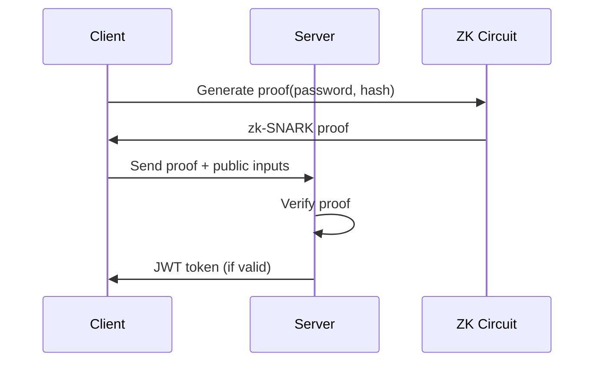

# ZeroGate

A secure, full-stack authentication application using zero-knowledge proofs (zk-SNARKs) to prove knowledge of secrets without revealing them. ZeroGate demonstrates privacy-preserving authentication where users can prove they know a password without ever transmitting it.

## 🔐 Overview

ZeroGate leverages **Circom circuits** and **zk-SNARKs** to create a novel authentication system where:
- Users prove knowledge of their password using cryptographic proofs
- The server verifies the proof without ever seeing the actual password
- Enhanced privacy and security compared to traditional authentication

## 🏗️ Architecture

The project consists of three main components:

### 1. **Circuits** (`/circuits`)
- **Circom circuits** for zero-knowledge proof generation
- **Poseidon hash** implementation for secure hashing
- **Trusted setup** ceremony for zk-SNARK parameters
- Circuit compilation and witness generation utilities

### 2. **Frontend** (`/client`)
- **React 18** with **TypeScript**
- **Vite** for fast development and building
- **Tailwind CSS** for modern, responsive UI
- **SnarkJS** integration for client-side proof generation
- **React Router** for navigation

### 3. **Backend** (`/server`)
- **Node.js** with **Express** and **TypeScript**
- **JWT-based** session management
- **zk-SNARK proof verification** using ZoKrates
- RESTful API for authentication endpoints
- **Winston** logging and error handling

## 🚀 Getting Started

### Prerequisites

- **Node.js** (v18 or higher)
- **npm** or **yarn**
- **Docker** (optional, for containerized deployment)
- **Circom** compiler (for circuit development)

### Installation

1. **Clone the repository:**
   ```bash
   git clone https://github.com/Ionut2888/ZeroGate.git
   cd ZeroGate
   ```

2. **Install root dependencies:**
   ```bash
   npm install
   ```

3. **Setup circuits:**
   ```bash
   cd circuits
   npm install
   # On Windows:
   .\setup.bat
   # On Linux/Mac:
   ./setup.sh
   ```

4. **Setup and start the server:**
   ```bash
   cd server
   npm install
   npm run build
   npm run dev
   ```

5. **Setup and start the client:**
   ```bash
   cd client
   npm install
   npm run dev
   ```

### Circuit Compilation

The project includes pre-compiled circuits, but you can recompile them:

```bash
cd circuits
# Windows PowerShell:
.\compile.ps1
# Or manually:
circom hash_preimage.circom --r1cs --wasm --sym -o build/
```

## 🔧 Development

### Project Structure

```
ZeroGate/
├── circuits/           # Zero-knowledge circuits
│   ├── hash_preimage.circom    # Main authentication circuit
│   ├── build/                  # Compiled circuits
│   └── setup/                  # Trusted setup files
├── client/            # React frontend
│   ├── src/
│   │   ├── components/        # React components
│   │   ├── contexts/          # Auth context
│   │   └── utils/             # SnarkJS utilities
│   └── public/circuits/       # Circuit files for browser
├── server/            # Express backend
│   ├── src/
│   │   ├── controllers/       # API controllers
│   │   ├── middleware/        # Auth & error middleware
│   │   └── services/          # Business logic
│   └── data/                  # User data storage
└── docker-compose.yml         # Docker configuration
```

### Key Technologies

- **Circom 2.0**: Circuit description language
- **SnarkJS**: JavaScript library for zk-SNARKs
- **Poseidon Hash**: Cryptographic hash function optimized for zk-SNARKs
- **ZoKrates**: Toolbox for zkSNARKs on Ethereum (used for verification)
- **React 18**: Frontend framework with hooks
- **TypeScript**: Type-safe JavaScript
- **Express.js**: Web framework for Node.js
- **Tailwind CSS**: Utility-first CSS framework

### Available Scripts

#### Root Level
```bash
npm test                # Run tests across all components
```

#### Circuits
```bash
npm run compile         # Compile circuits
npm run test           # Test circuit functionality
npm run setup          # Run trusted setup ceremony
```

#### Client
```bash
npm run dev            # Start development server
npm run build          # Build for production
npm run lint           # Run ESLint
npm run test           # Run tests
```

#### Server
```bash
npm run dev            # Start development server
npm run build          # Compile TypeScript
npm run start          # Start production server
npm run test           # Run tests
```

## 🐳 Docker Deployment

### Development
```bash
docker-compose up -d
```

### Production
```bash
docker-compose -f docker-compose.prod.yml up -d
```

See `DEPLOYMENT.md` for detailed production deployment instructions.

## 🔒 How It Works

1. **Registration**: User provides a password, client generates a Poseidon hash
2. **Circuit Proof**: Client generates a zk-SNARK proof that they know the preimage of the hash
3. **Verification**: Server verifies the proof without seeing the password
4. **Authentication**: Valid proofs result in JWT token issuance

### Authentication Flow



## 🧪 Testing

Run the test suite:

```bash
# Test circuits
cd circuits && npm test

# Test client
cd client && npm test

# Test server
cd server && npm test
```

## 📚 API Documentation

### Authentication Endpoints

- `POST /api/auth/register` - Register new user with zk-proof
- `POST /api/auth/login` - Login with zk-proof verification
- `GET /api/auth/profile` - Get user profile (protected)
- `POST /api/auth/logout` - Logout user

## 🤝 Contributing

1. Fork the repository
2. Create a feature branch: `git checkout -b feature/amazing-feature`
3. Commit changes: `git commit -m 'Add amazing feature'`
4. Push to branch: `git push origin feature/amazing-feature`
5. Open a Pull Request

## 📄 License

This project is licensed under the ISC License - see the LICENSE file for details.

## 🙏 Acknowledgments

- **Circom** team for the circuit language
- **SnarkJS** for JavaScript zk-SNARK utilities
- **ZoKrates** for the verification framework
- **Poseidon** hash function designers

## 🔗 Links

- [Circom Documentation](https://docs.circom.io/)
- [SnarkJS Documentation](https://github.com/iden3/snarkjs)
- [ZoKrates Documentation](https://zokrates.github.io/)
- [Zero-Knowledge Proofs Explained](https://blog.ethereum.org/2016/12/05/zksnarks-in-a-nutshell/)

